# Recruitment Gorilla User Guide

Recruitment Gorilla is the in-house applicant tracking system. Recruiters upload CVs, the system
extracts the candidate's details for review, and every candidate moves through a hiring pipeline
from **Uploaded** to **Hired**, with interviews, structured evaluations, offers, dashboards and a
full audit trail along the way.

This guide is organized **by role**. Read *Getting started* first, then the chapter for your
role. Every capability of a lower role is also available to the roles above it.

*Last updated: 4 October 2026.*

## Contents

- [Chapter 0: Getting started](#chapter-0-getting-started) (everyone)
- [Chapter 1: Interviewer guide](#chapter-1-interviewer-guide)
- [Chapter 2: Recruiter guide](#chapter-2-recruiter-guide)
- [Chapter 3: Admin guide](#chapter-3-admin-guide)
- [Chapter 4: Super Admin guide](#chapter-4-super-admin-guide)
- [Chapter 5: Appendix](#chapter-5-appendix) (permission matrix, pipeline map, FAQ)

## The four roles at a glance

Roles form a hierarchy. Each role can do everything the roles below it can:

**Super Admin** > **Admin** > **Recruiter** > **Interviewer**

| Role | In one sentence |
|---|---|
| **Interviewer** | Sees the interviews assigned to them and submits structured evaluations. |
| **Recruiter** | Uploads CVs, maintains candidate profiles, schedules interviews and drafts offers for the candidates they own or whose job opening they are assigned to. |
| **Admin** | Everything a Recruiter does, on *all* candidates, plus configuration, offer approval, candidate deletion and the audit trail. |
| **Super Admin** | Everything, plus user accounts, email settings and deleting job openings. |

A user can hold **more than one role**. Their access is the combination of all of them.

> **About the screenshots:** they were taken with demo accounts and fictional candidates
> (for example "Demo Recruiter" and "Sadia Islam"). Your screens show your organization's
> data, but the layout is the same.

---

# Chapter 0: Getting started

*For everyone: signing in, your first login, and the parts of the app that look the same for
every role.*

## 0.1 Signing in

Open the application in your browser. Sign in with your **email address** and the password your
administrator gave you.

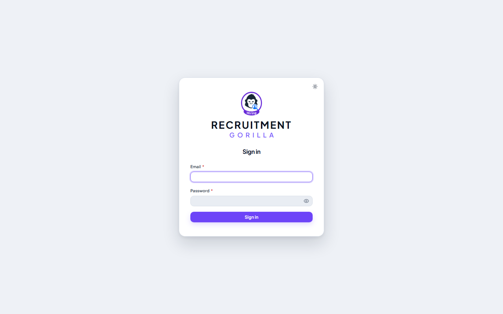

- After signing in you land on the **Dashboard**, or on the page you were trying to open.
- Your session stays active in the background until it expires or you sign out.
- On a shared computer, always **Sign out** from the user menu. It ends your session completely.

## 0.2 First login: set your own password

Accounts are created by a Super Admin with a **temporary password**. The first time you sign in,
and after any password reset, the app takes you to *Change password* and keeps you there until you
choose your own password.

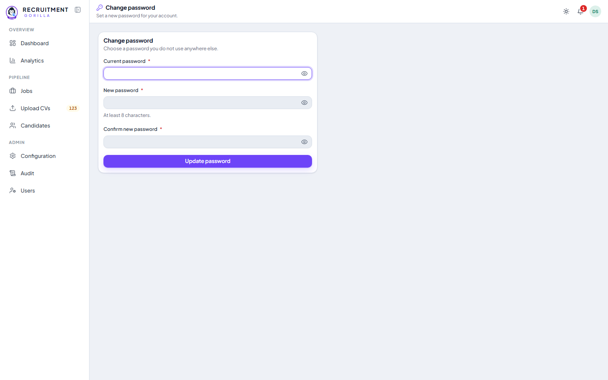

1. Enter the temporary password as **Current password**.
2. Choose a **New password** of at least 8 characters, different from the current one.
3. Enter it again in **Confirm new password** and select **Update password**. You are taken to
   the Dashboard.

You can change your password at any time from the **user menu** (your initials, top right) >
**Change password**. You also get an email when your password changes.

## 0.3 Finding your way around

The **sidebar** on the left shows only the pages your role can use. Select the icon beside the
logo to collapse it.

| Sidebar group | Pages | Visible to |
|---|---|---|
| Overview | **Dashboard** | everyone |
| Overview | **Analytics** | Recruiter and above |
| Pipeline | **Jobs**, **Upload CVs** (with a count of drafts waiting), **Candidates** | Recruiter and above |
| Admin | **Configuration**, **Audit** | Admin and above |
| Admin | **Users** | Super Admin only |

If you open a page your role cannot use, you are taken back to the Dashboard.

The **top bar** shows the page title and a one-line description, and on the right:

- **Theme** (sun or moon icon): Light, Dark, or System.
- **Notifications** (bell): a red badge counts unread items. Select one to open the related
  page, or **Mark all read**. The list refreshes about once a minute.
- **User menu** (your initials): your name, email and roles, **Change password** and
  **Sign out**.

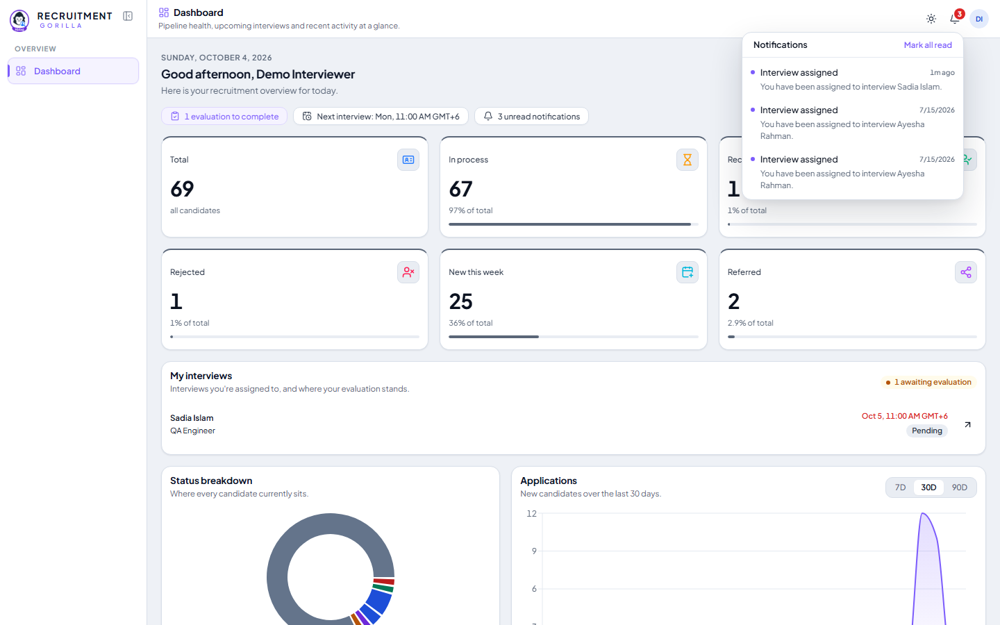

## 0.4 The Dashboard

Everyone lands on the **Dashboard**. At the top, a greeting with "needs your attention" chips,
such as *1 evaluation to complete*, *Next interview: ...* or *3 unread notifications*. Below it:

- Six organization-wide counts: **Total**, **In process**, **Recommended**, **Rejected**,
  **New this week** and **Referred**. Recruiters and above can select a count to open the
  matching candidate list.
- **My interviews**: the interviews you are assigned to.
- **Status breakdown** and **Applications** over 7, 30 or 90 days.
- **Active job openings**: open roles with their end date and number of applicants.

Recruiters and above also get a **My pipeline** section. See [2.2](#22-your-dashboard).

---

# Chapter 1: Interviewer guide

*You review the candidates you are scheduled to interview and submit a structured evaluation.
A recruiter cannot mark an interview as completed until at least one interviewer has submitted,
so the pipeline waits for you.*

## 1.1 What you can see

As an Interviewer you see the **Dashboard** and the **interviews assigned to you**. You cannot
browse the candidate list. Each interview gives you a read-only view of that candidate, including
their CV.

## 1.2 Your interviews

When you are assigned to an interview you get a **notification** in the app and an **email with
a calendar invite**. The interview also appears under **My interviews** on your Dashboard:

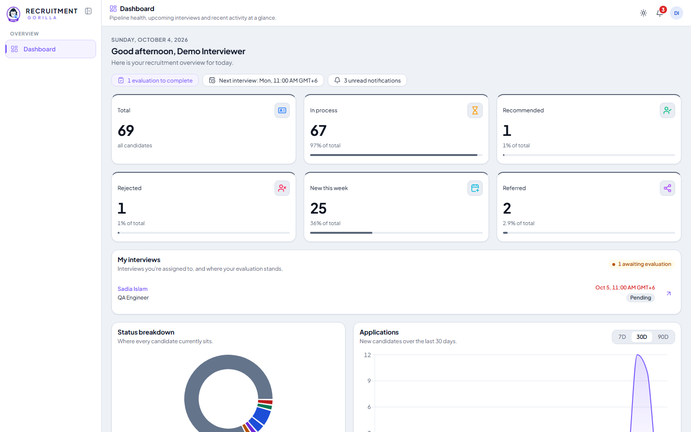

- Each row shows the candidate, the job opening, the date and time (in red when it is less than
  24 hours away) and your evaluation state: **Pending**, **Draft** or **Submitted**.
- Select a row to open the interview page.

## 1.3 The interview page

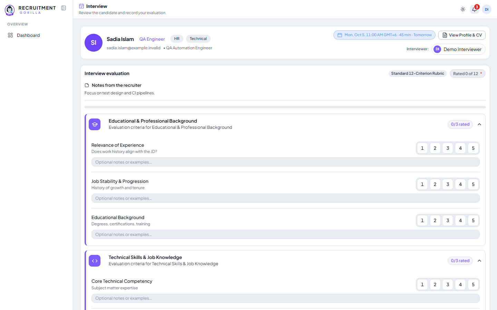

- **Header:** the candidate's name and email, the job opening, the interview type tags (for
  example *Technical*, *HR*), the date with its duration, and the interview panel.
- **View Profile & CV:** opens the candidate's profile in a side panel: contact details,
  experience, skills, summary, education, work history and the CV itself.
- **Notes from the recruiter:** what the recruiter wants you to know before the interview.
- **Interview evaluation:** the form, described next. The badge at the top shows which rubric
  is used and how many criteria you have rated.

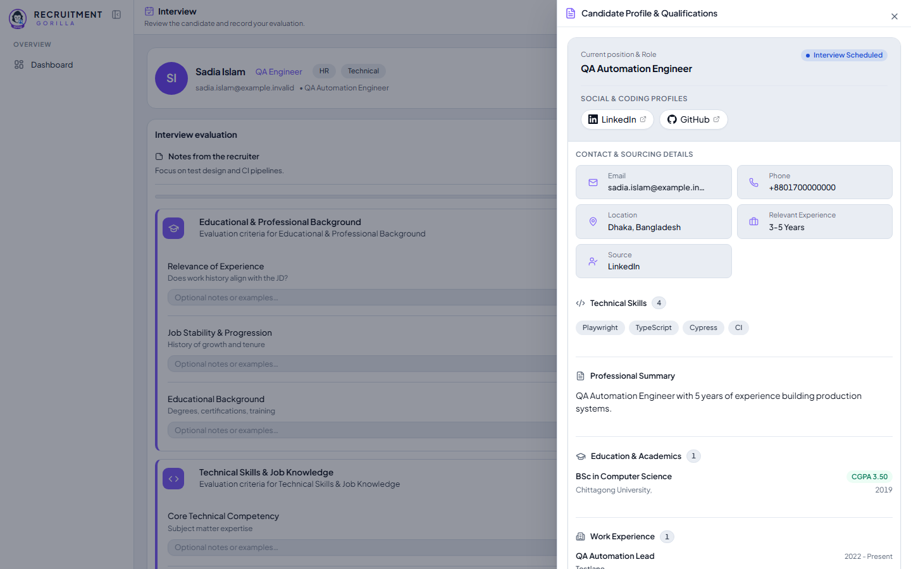

## 1.4 Filling in the evaluation

The evaluation uses the **rubric** set for the job opening (by default, 12 criteria in four
sections). Rate each criterion from **1 to 5** and add notes if useful:

- **Educational & Professional Background:** relevance of experience, job stability and
  progression, educational background.
- **Technical Skills & Job Knowledge:** core technical competency, tools and software
  proficiency, problem-solving.
- **Soft Skills & Communication:** communication clarity, listening, adaptability.
- **Cultural Fit & Motivation:** alignment with company values, motivation, team dynamics.

At the bottom, the **Overall evaluation** asks for:

- **General assessment:** free text on strengths, areas to improve and concerns.
- **Final recommendation** (required): **Recommended**, **Hold**, **Reject** or **Other**
  (Other asks you to explain).
- **Overall rating** (required): your single 1 to 5 verdict.

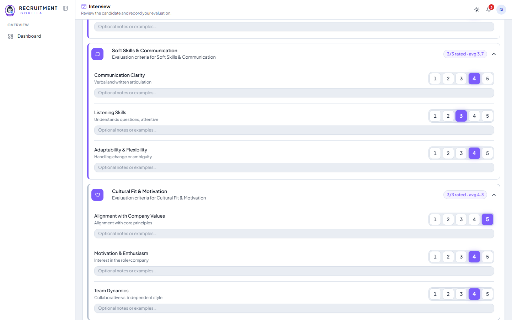

## 1.5 Save draft or Submit

| Button | What it does |
|---|---|
| **Save draft** | Saves what you have entered so far. Nothing is required. Come back any time. |
| **Submit evaluation** | Finalizes your evaluation. Every criterion must be rated and the recommendation and overall rating chosen. You are asked to confirm. |

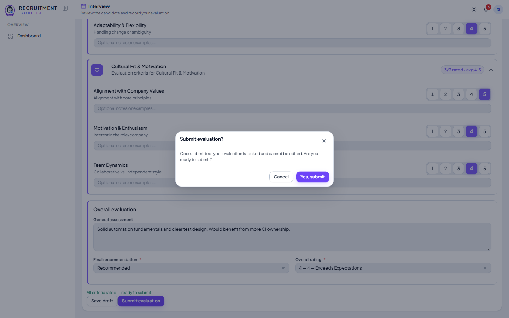

**Submitting is final.** Your evaluation is then locked and shown read-only:

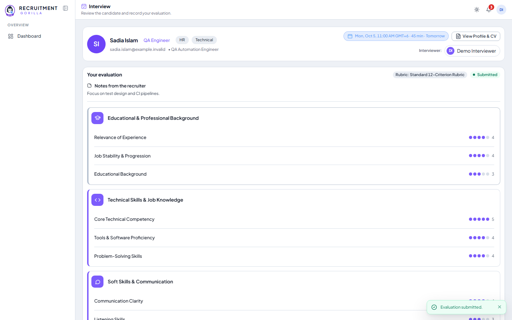

After you submit, you can also see the evaluations other panel members have submitted for the
same interview. You cannot see theirs before you submit your own.

---

# Chapter 2: Recruiter guide

*You run the pipeline: upload CVs, keep profiles accurate, move candidates from **Uploaded**
towards **Hired**, schedule interviews and prepare offers.*

## 2.1 Which candidates you can see

You can work with a candidate when **either** is true:

1. **You created them** (you are the owner), or
2. **You are an assigned recruiter of their job opening.** An Admin assigns recruiters to each
   opening in Configuration. Every candidate under that opening is then yours to manage,
   whoever created them.

This rule applies everywhere: the candidate list, profiles, CV files, status changes, offers,
Analytics and your Dashboard. You **cannot delete** candidates; ask an Admin.

## 2.2 Your dashboard

Your Dashboard adds **Candidates** and **Upload CVs** shortcuts at the top:

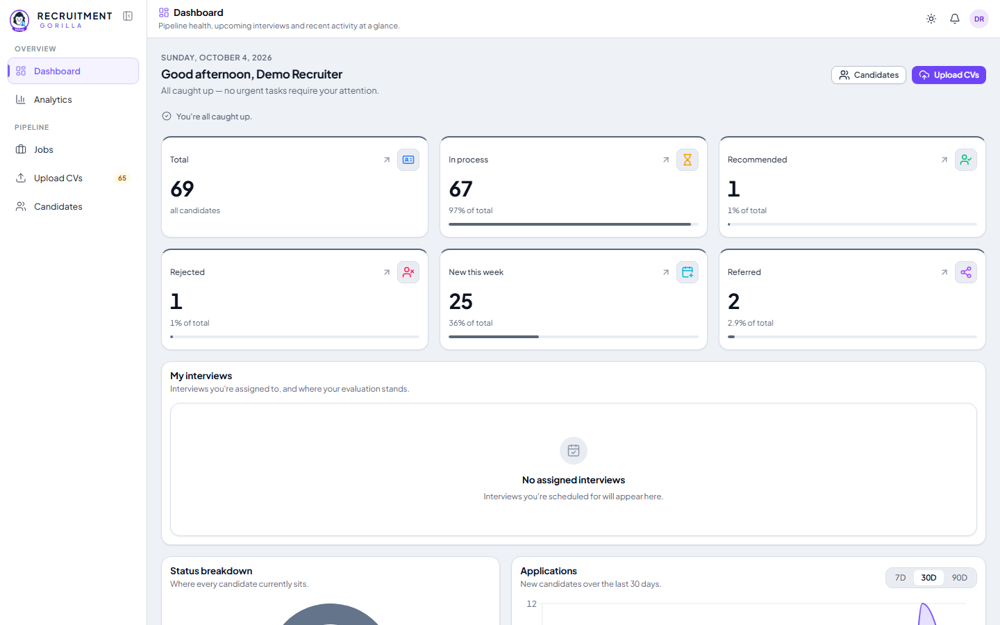

Further down, **My pipeline** is scoped to your candidates, with a **Role** filter for one of your
job openings: candidates by role, top skills, offer metrics, upcoming interviews and recent
activity.

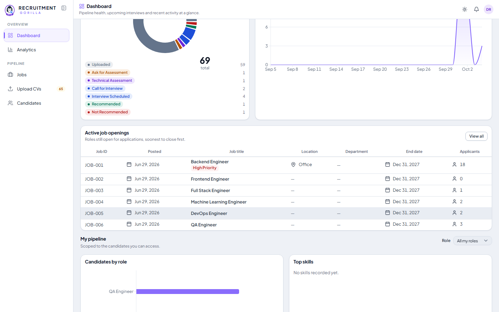

## 2.3 Adding candidates: Upload CVs

Adding candidates has two steps: **upload** the CVs, then **review** what was extracted.

**Step 1: Upload & Intake**

1. Open **Upload CVs**.
2. Optionally enter a **Batch label** (for example "QA intake October") and pick the
   **Job opening** the CVs are for.
3. Drag PDF or Word (.docx) files onto the drop area, or select it to browse. Each file can be
   up to 10 MB, and you can drop many at once.

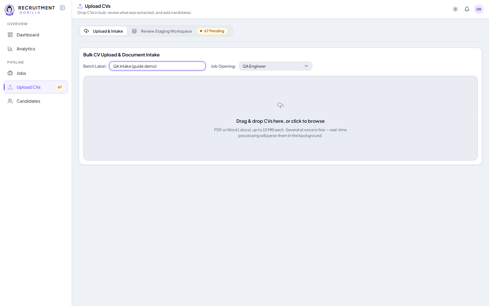

Each CV is read in the background and saved as a **draft**. When it finishes, select
**Open Review Workspace**.

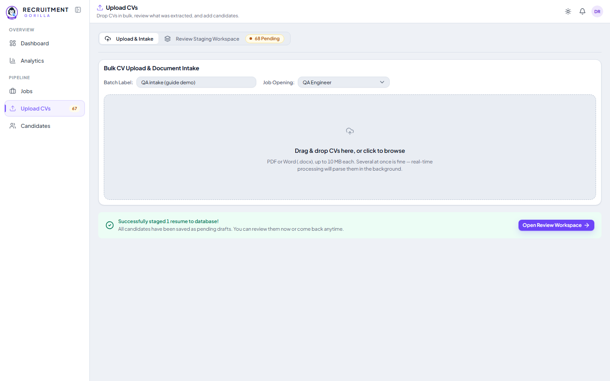

A CV the system already holds (waiting as a draft, or attached to a candidate) is skipped and
marked **Duplicate**.

**Step 2: Review Staging Workspace**

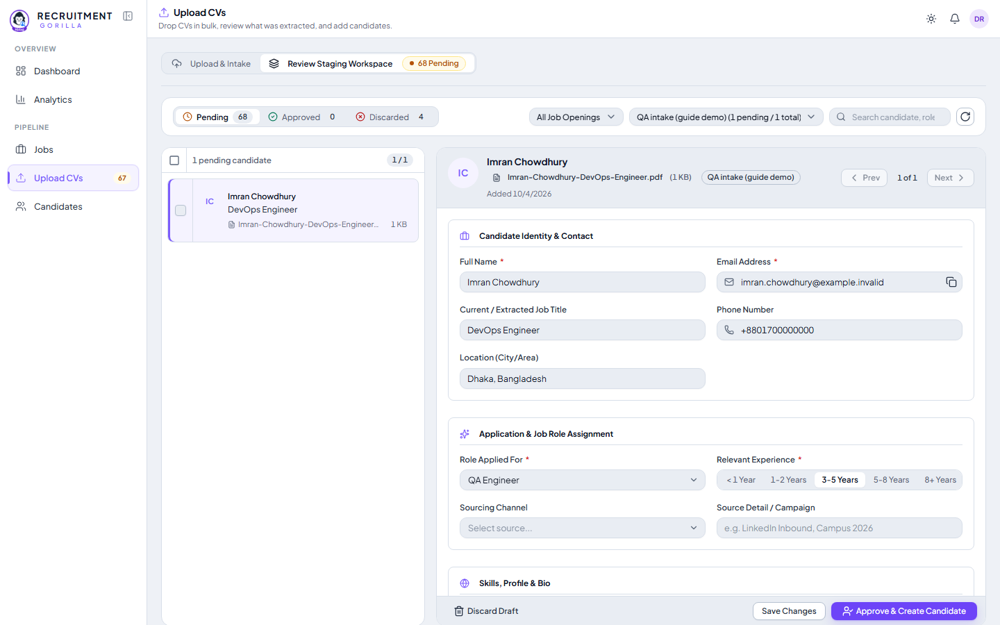

- The left list shows your **Pending** drafts. Filter by job opening or upload batch, or search.
- The right side shows the extracted details for the selected draft. Check and correct them:
  name, email, phone, title, location, role applied for, relevant experience, sourcing channel,
  skills, summary, links, education and work history.
- **Approve & Create Candidate** creates the candidate at status **Uploaded**.
  **Save Changes** keeps your edits for later. **Discard Draft** removes it.
- Shortcuts: Ctrl+Enter approves, Ctrl+Left and Ctrl+Right move through the queue.
- Tick several drafts to **Approve Selected** or **Discard Selected** at once.

Required to approve: **Full name**, a valid **Email**, and a **Role applied for** that is
active and not past its end date.

## 2.4 The candidate list

**Candidates** shows everyone you can access.

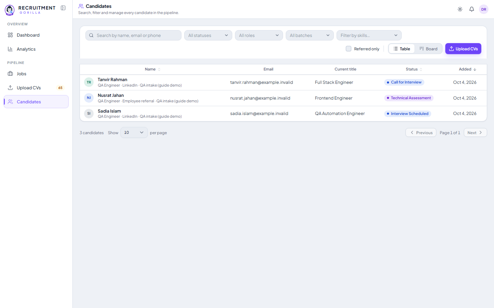

- Search by name, email or phone. Filter by status, role, batch, skills, or **Referred only**.
  **Clear filters** resets them.
- Sort by **Name**, **Status** or **Added** (newest first by default). Choose 10 to 100 rows per
  page.
- Your filters are kept in the page address, so you can bookmark or share a filtered list.

Switch to **Board** to see one column per pipeline stage:

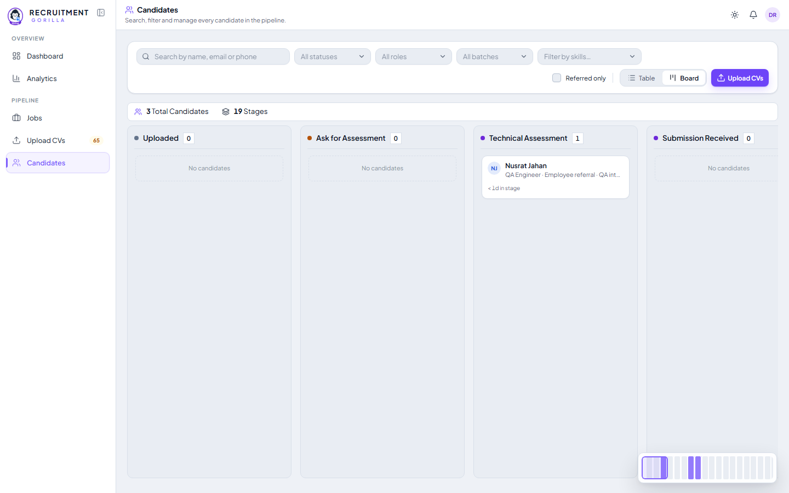

**Drag a card** to another column to change its status. If the new status needs more details
(for example an interview time), the **Add status** panel opens. A move that the pipeline does
not allow is refused with a message.

## 2.5 The candidate profile

Select a candidate to open their profile:

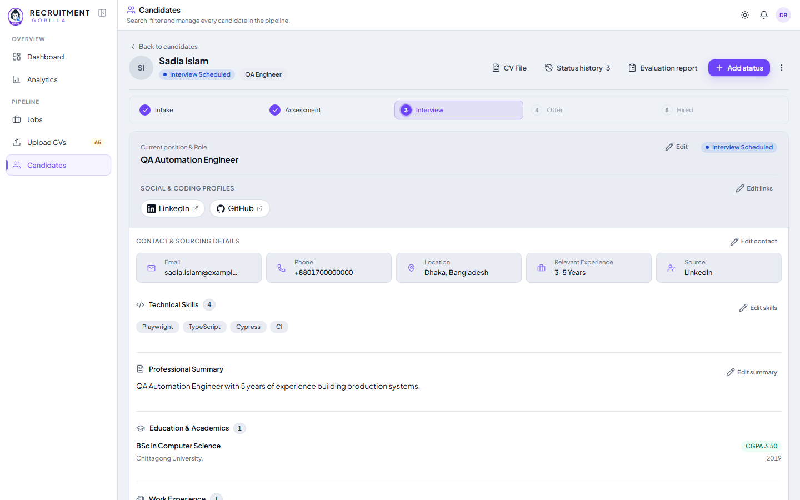

- **Header:** name, current status and job opening, plus **CV File** (preview and download),
  **Status history**, **Evaluation report**, **Add status**, and the **...** menu with
  **Edit profile** (and **Delete candidate** for Admins).
- **Pipeline stepper:** Intake > Assessment > Interview > Offer > Hired.
- **Profile:** current position, LinkedIn and GitHub links, contact and sourcing details,
  skills, summary, education and work experience. Each part has its own **Edit** link.
- **Offer & Compensation:** appears once the candidate is recommended. See [2.8](#28-offers).

**Status history** opens the full timeline, newest first. Each entry shows the status, when and
who changed it, the comment and any details (task, submission link, interview time, tags and
panel). **Advance Stage** opens Add status from here.

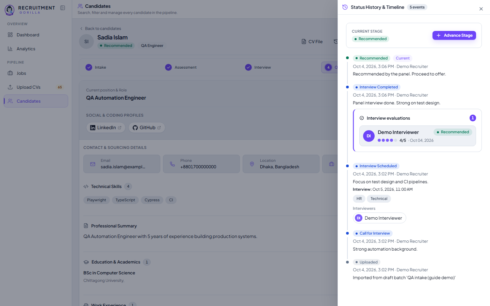

> If the job opening's **End Date** has passed, a "Job opening closed" banner appears and
> editing, status changes and offers are blocked for everyone until an Admin extends the date.

## 2.6 Moving a candidate through the pipeline

Select **Add status**, choose the **New status**, add a comment and **Save status**. Only the
statuses allowed from the current one are offered. The main path is:

**Uploaded > Ask for Assessment > Technical Assessment > Submission Received > Code Review >
Call for Interview > Interview Scheduled > Interview Completed > Recommended > Offer Preparation
> Offer Extended > Offer Accepted > Hired**

You can also go straight from **Uploaded** to **Call for Interview**. Side exits such as
**Not Available**, **Reject**, **Discontinued**, **No Submission**, **Not Recommended** and
**Offer Declined** are offered where they apply. The full map is in [5.2](#52-the-pipeline-map).

Some statuses need extra details. The form asks for them:

| Moving to... | You must provide |
|---|---|
| **Technical Assessment** | the **task details** and a comment |
| **Submission Received** | the **submission link** |
| **Interview Scheduled** | **date and time** and at least one **interviewer** |
| **Interview Completed** | a comment; at least one interviewer must have **submitted** their evaluation |
| **Reject**, **Discontinued**, **Offer Declined** | a comment explaining why |
| **Recommended** | the candidate must have passed **Code Review** or **Interview Completed** |
| **Hired** | the candidate must have **Offer Accepted** |

## 2.7 Scheduling interviews

Choose **Interview Scheduled** in Add status and the form expands:

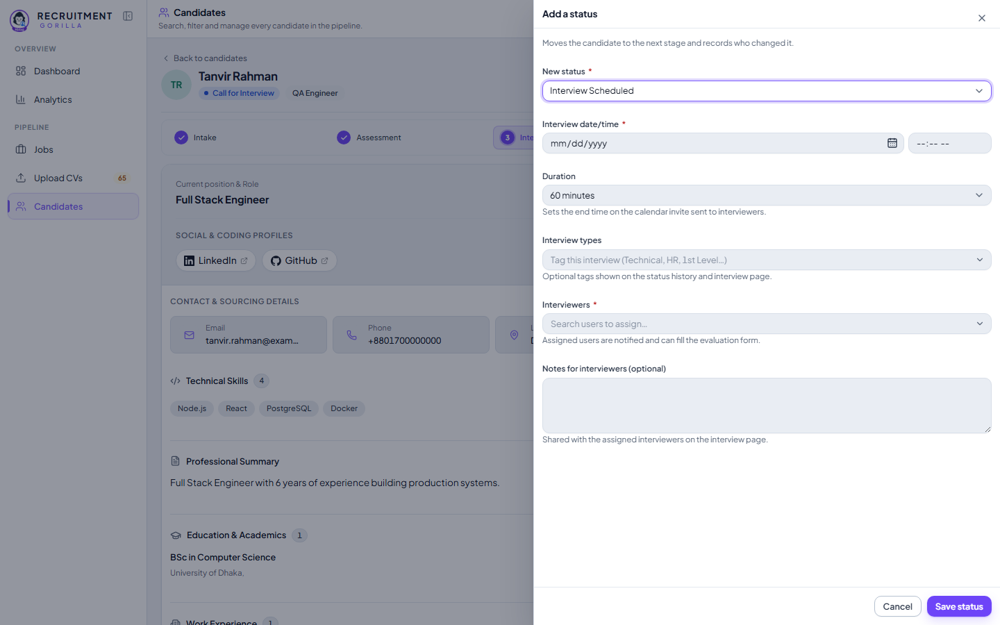

- **Interview date/time** (required) and **Duration** (15 to 120 minutes).
- **Interview types:** optional tags such as *Technical*, *HR*, *1st Level*.
- **Interviewers** (required, one or more): each gets a notification, an email with a calendar
  invite, and the interview on their Dashboard.
- **Notes for interviewers:** shown to the panel as "Notes from the recruiter".

**Completing an interview.** After the panel has submitted, move the candidate to
**Interview Completed**. **Evaluation report** then shows every submitted evaluation, the average
overall rating, the recommendations and the average per criterion. Use **Print** or
**Open as a page** to share it.

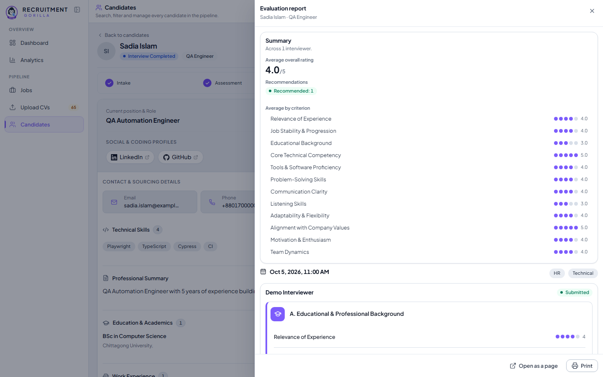

**Another round?** From **Interview Completed** you can schedule again. The new interview gets
its own panel and evaluations, and the history keeps both rounds.

## 2.8 Offers

Once a candidate is **Recommended**, the **Offer & Compensation** card lets you prepare an offer.

1. Select **Draft Offer** and fill in the job title, **annual base salary**, currency, and
   optionally bonus, equity, start date, expiry date and notes. **Create Offer**.
   The candidate moves to **Offer Preparation**.

   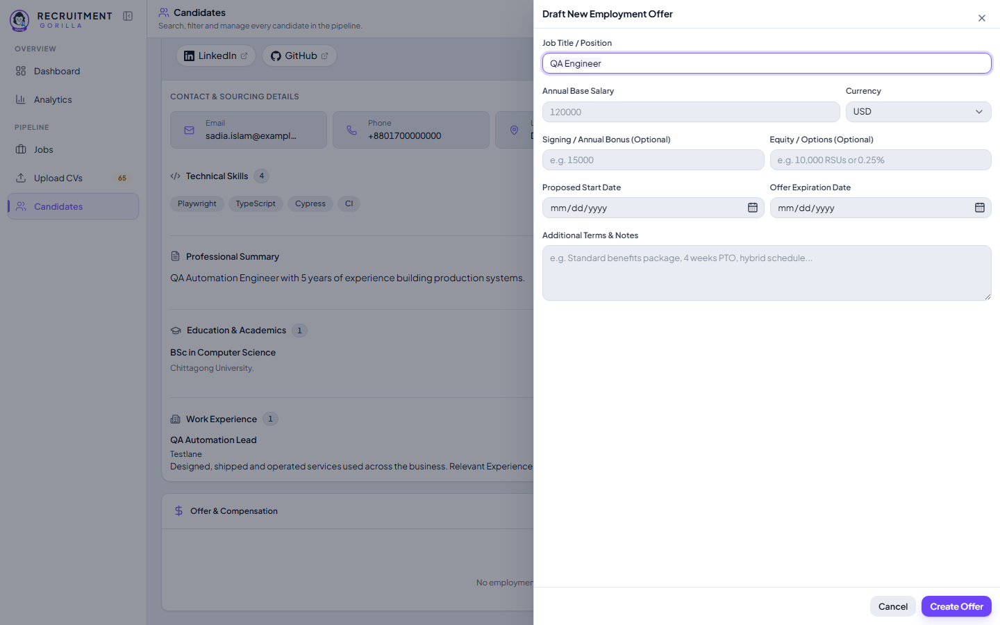

2. **Request Approval** sends it to an Admin, who approves or rejects it (a rejected offer goes
   back to draft). Approval is optional: you can also **Extend Offer** straight from a draft.

   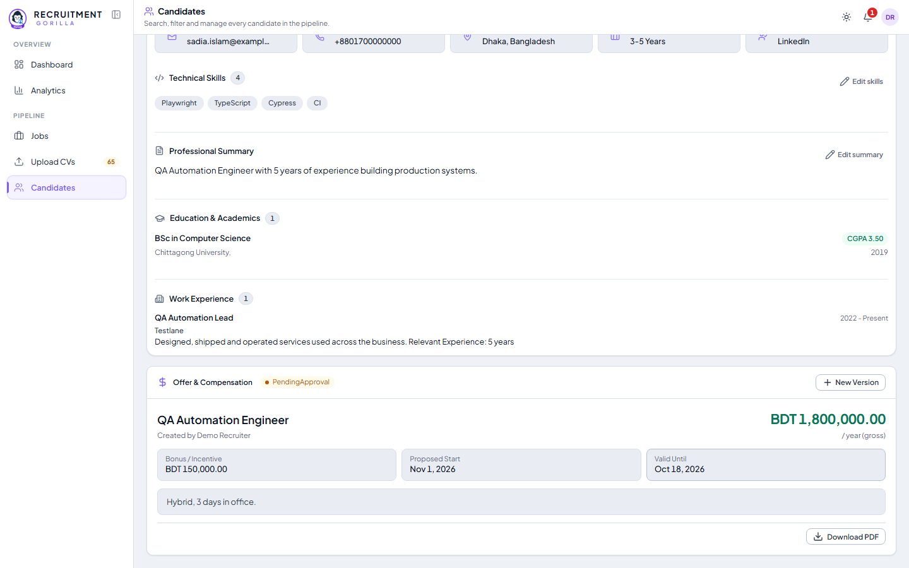

3. **Extend Offer to Candidate** moves the candidate to **Offer Extended**. Send the offer
   itself outside the app (use **Download PDF**).
4. **Record Candidate Decision:** **Accepted** moves the candidate to **Offer Accepted**;
   **Declined** (with a reason) moves them to **Offer Declined**.
5. Finally, use **Add status** > **Hired**.

**New Version** starts a revised offer. The app never emails candidates; all candidate
communication happens outside it.

## 2.9 Jobs and Analytics

**Jobs** gives an overview of every job opening: totals, active and closing-soon counts, each
opening's status, priority, deadline progress, rubric and assigned recruiters. Select an
opening's candidate count to see those candidates. Openings are created and edited by Admins in
Configuration.

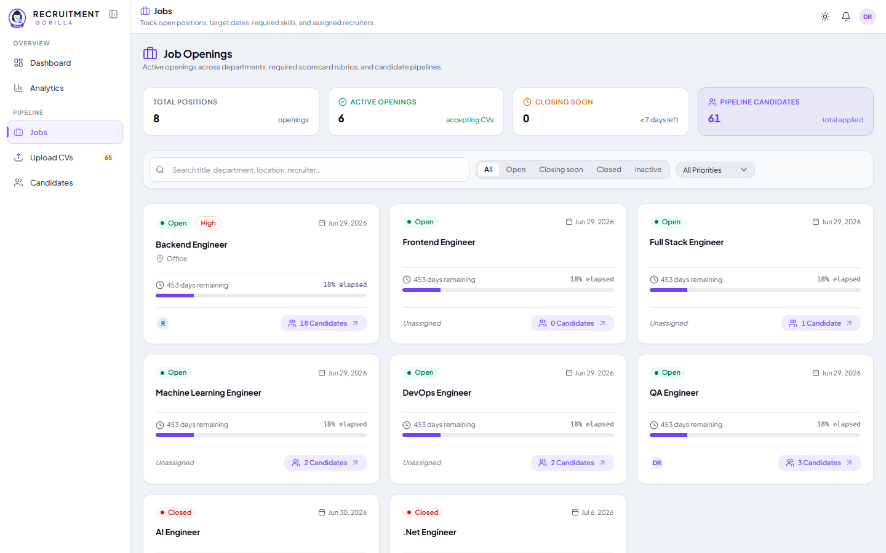

**Analytics** shows average time to hire, pipeline velocity, funnel conversion, stage dwell time
(stages over 7 days are flagged), sourcing channel performance and recruiter workload. Choose a
period (7 days to All time) and a job opening. As a Recruiter you see figures for your own
candidates only. **Print Report** prints the page.

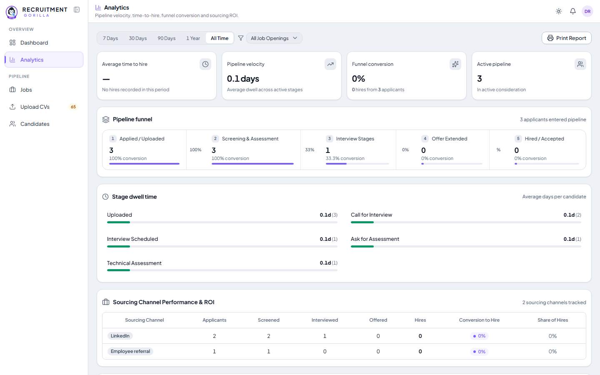

---

# Chapter 3: Admin guide

*You keep the system running for everyone else. An Admin can do everything a Recruiter can, on
**all** candidates, plus approve offers, maintain configuration, delete candidates and review the
audit trail.*

## 3.1 What Admin adds

| Capability | Notes |
|---|---|
| See and manage **all** candidates | no ownership or assignment limits |
| **Approve or reject offers** | on offers a recruiter sent for approval |
| See evaluation cards in the **Status history** | recruiters see them in the Evaluation report |
| **Delete** a candidate | permanent: removes the profile, history and CV files |
| **Configuration** | rubrics, skills, sources, interview types, job openings |
| **Audit** | the who-changed-what-when log |

## 3.2 Approving offers

An offer waiting for approval shows **Approve Offer** and **Reject** to Admins:

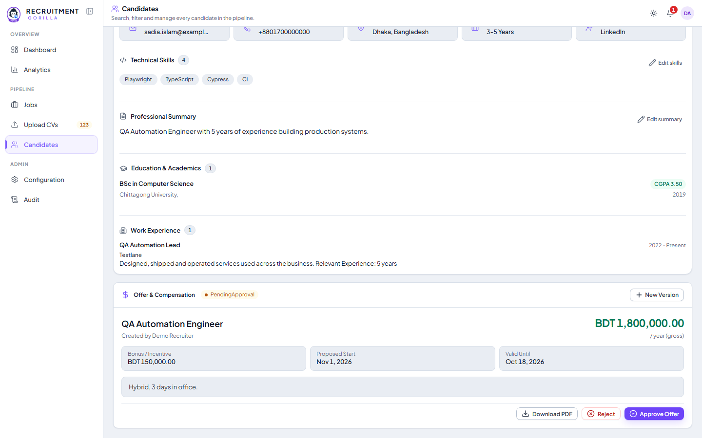

In the candidate's **Status history**, Admins also see each interviewer's evaluation card
(recommendation and overall rating) under **Interview Completed**:

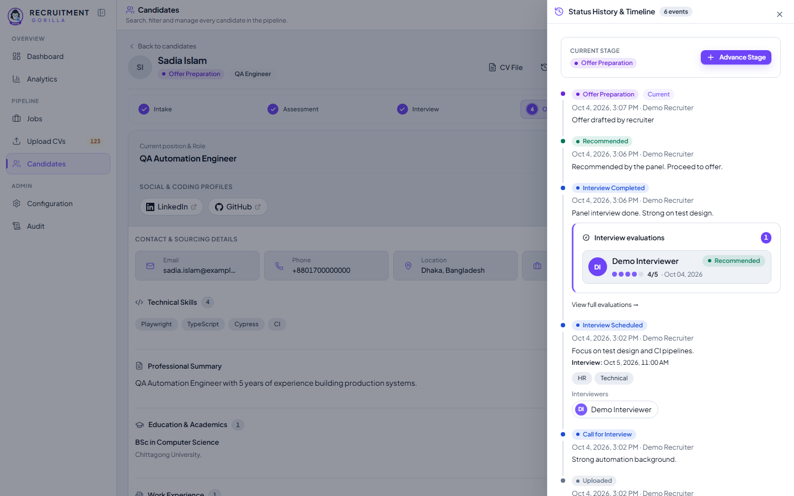

## 3.3 Configuration

**Configuration** has one tab per list. Each tab has search and All, Active and Inactive
filters.

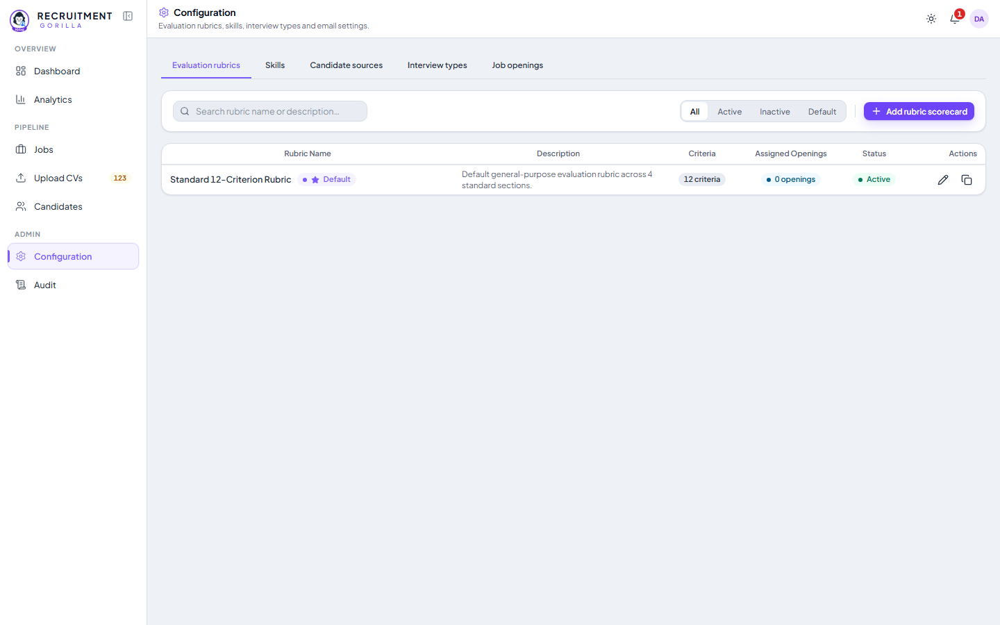

| Tab | What you manage |
|---|---|
| **Evaluation rubrics** | The scorecards interviewers fill in: sections, criteria and weights. Create, edit, duplicate, set the default, or delete (the default rubric cannot be deleted). |
| **Skills** | Skill tags offered on candidate profiles and in filters. |
| **Candidate sources** | Where candidates come from (LinkedIn, Employee referral...), used in Analytics. |
| **Interview types** | Tags recruiters attach when scheduling (Technical, HR, 1st Level...). |
| **Job openings** | Each opening's name, **Closes** date (required), priority, location, department, **rubric**, **recruiters** and Active flag. |

For skills, sources and interview types, deleting an item that is already in use deactivates it
instead, so history is kept.

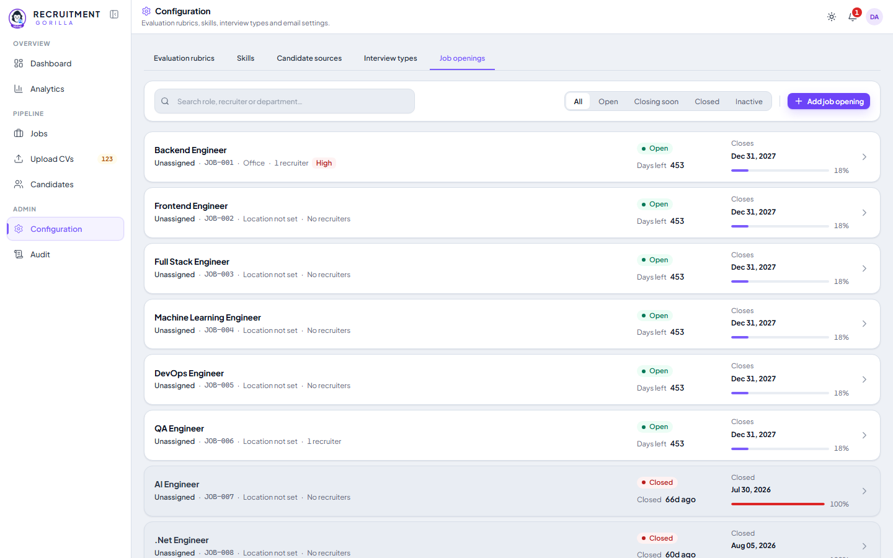

Job openings drive access and locking, so keep them current:

- **Recruiters:** assigning a recruiter gives them every candidate under the opening.
- **Closes date:** after it passes, the opening locks: no edits, status changes or offers for its
  candidates until you extend the date.
- **Rubric:** the scorecard interviewers use for this opening (the default rubric if none).
- Deleting an opening is **Super Admin only**.

## 3.4 Deleting a candidate

On the candidate list (row menu) or the profile (**...** menu), Admins have **Delete**. After
you confirm, the candidate, their history and CV files are removed permanently. The deletion is
recorded in the audit trail.

## 3.5 The audit trail

**Audit** answers "who changed what, and when":

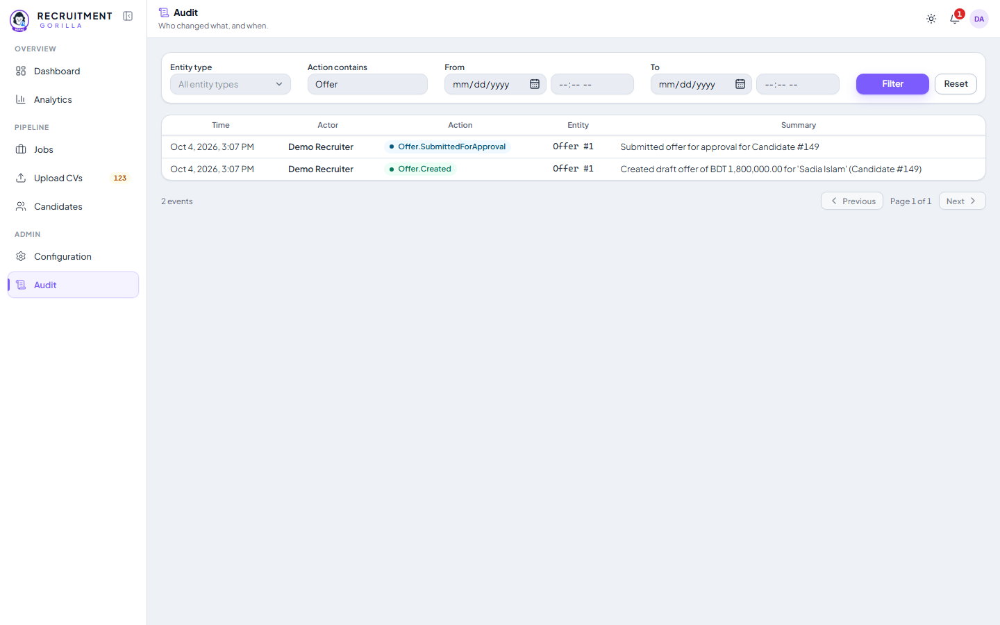

Every change is recorded: sign-ins (including **failed** attempts), password changes, candidate
changes and status moves, evaluations, offers, configuration and user management. Each row shows
the time, the person, a colored action (for example `Offer.Created`, `Auth.LoginFailed`), the
record and a summary.

Filter by **Entity type**, **Action contains** and a **From / To** date and time, then
**Filter**. Results are newest first, 50 per page. The log cannot be edited or deleted by anyone.

---

# Chapter 4: Super Admin guide

*You own the accounts. A Super Admin can do everything an Admin can, plus manage users, email
settings, deleting job openings and importing candidates from JSON.*

## 4.1 What Super Admin adds

| Capability | Notes |
|---|---|
| **Users** page | add users, set roles, activate or deactivate, reset passwords |
| **Email** tab in Configuration | the mail server used for invites and account emails |
| **Delete** a job opening | Admins can only edit or deactivate openings |
| **JSON + CVs** import on Upload CVs | import candidates from a filled-in JSON template plus their CVs |

## 4.2 Managing users

**Users** lists every account with name, email, roles, status, last login, and whether they must
change their password.

**Add user** and provide:

- **Name** and **Email**. The email is the sign-in and must be unique.
- **Roles:** one or more of Super Admin, Admin, Recruiter, Interviewer.
- **Temporary password** (at least 8 characters). The user gets an email and must set their own
  password at first sign-in (see [0.2](#02-first-login-set-your-own-password)).

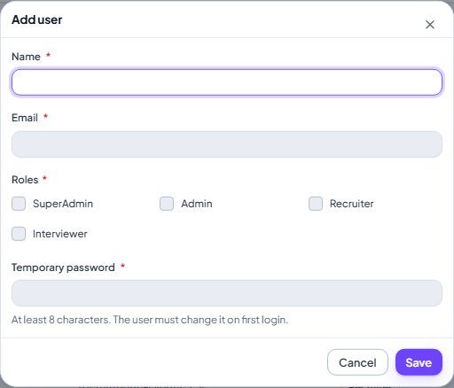

**Choosing the right role:**

- Only conducts interviews: **Interviewer**.
- Sources and manages candidates: **Recruiter**, then have an Admin assign them to job openings,
  or they will only see candidates they create themselves.
- Maintains configuration, approves offers or needs to see everything: **Admin**.
- Keep **Super Admin** to the smallest possible group.

**Edit** changes a user's name, roles and Active flag. **Deactivate** stops the account from
signing in and from being assigned to interviews; its history is kept. There is no delete.
**Reset password** sets a new temporary password; the user is emailed and must change it at next
sign-in.

> **Guard rail:** the system refuses to deactivate, or remove the role from, the **last active
> Super Admin**, so you cannot lock everyone out.

## 4.3 Email settings

The **Email** tab (Super Admin only) holds the mail server settings: host, port, STARTTLS,
username, password, sender address and name, plus **Email Delivery** on or off and a test send.
The app emails **users** only (interview invites, new accounts, password resets and changes),
never candidates.

## 4.4 Importing candidates from JSON

When you already have candidate details in structured form (an export from another system, a
spreadsheet, or an AI assistant's summary of each CV), you can import them instead of relying on
CV parsing. Every candidate still needs their CV, and every import still lands in the Review
Staging Workspace for approval.

1. Open **Upload CVs** and choose **JSON + CVs** (only Super Admins see this switch).
2. Select **Download JSON template**. The comments at the top of the file are the instructions:
   the mandatory fields (**cvFileName**, **fullName**, **email**), the optional ones, and the job
   opening and source names you can use. They are current on the day you download the file.
3. Fill in one entry per candidate, by hand or by giving the template and the CVs to an AI
   assistant. The comments are written so an assistant can follow them; the importer ignores
   them, so it does not matter whether they are kept.
4. Set **cvFileName** to each CV's exact file name, for example `jane_doe.pdf`.
5. Optionally enter a **Batch label** and a default **Job opening** for entries that name no role.
6. Drop the JSON file together with all the CVs onto the drop area.

The pre-check table shows every entry before anything is saved:

- **Ready**: the entry will be imported.
- **Ready, check notes**: it will be imported, but something needs attention in review, such as
  a role or source name that does not match (that field is left blank for you to pick) or an
  email that already belongs to a candidate.
- **Will be skipped**: something is wrong, such as a missing mandatory field, an invalid email, or
  no CV with that file name. The reason is shown on the row.

Select **Import N candidates**. Each entry becomes a **Pending** draft with its CV attached, filled
in from the JSON. Then select **Open Review Workspace** and approve the drafts as in
[2.3](#23-adding-candidates-upload-cvs). A CV the system already holds is marked **Duplicate** and
not imported.

## 4.5 Deleting job openings

Only Super Admins can delete an opening in Configuration. If candidates were ever filed under it,
the opening is deactivated instead and the app shows how many candidates block deletion.

## 4.6 Good habits

- Check **Audit** now and then for bursts of `Auth.LoginFailed` and unexpected user or role
  changes.
- Deactivate accounts of people who leave. The **Last login** column shows inactive accounts.
- Keep each opening's **recruiters** and **Closes** date current: they control access and
  locking.

---

# Chapter 5: Appendix

## 5.1 Permission matrix

| Capability | Super Admin | Admin | Recruiter | Interviewer |
|---|:-:|:-:|:-:|:-:|
| Dashboard | Yes | Yes | Yes | Yes |
| Assigned interviews and evaluations | Yes | Yes | Yes | Yes |
| Analytics, Jobs | Yes | Yes | own scope | - |
| View and browse candidates | all | all | own or assigned opening | assigned interviews only |
| Upload CVs and create candidates | Yes | Yes | Yes (becomes owner) | - |
| Import candidates from JSON | Yes | - | - | - |
| Edit candidates, change status | all | all | own or assigned opening | - |
| Evaluation report | all | all | own or assigned opening | - |
| Draft and extend offers | Yes | Yes | own or assigned opening | - |
| Approve or reject offers | Yes | Yes | - | - |
| Delete candidate | Yes | Yes | - | - |
| Configuration | Yes | Yes | - | - |
| Delete a job opening | Yes | - | - | - |
| Audit | Yes | Yes | - | - |
| Users, Email settings | Yes | - | - | - |

## 5.2 The pipeline map

| From | Can move to |
|---|---|
| Uploaded | Ask for Assessment, Call for Interview, Not Available, Reject, Discontinued |
| Ask for Assessment | Technical Assessment, Not Available, Discontinued |
| Technical Assessment | Submission Received, No Submission, Not Available, Discontinued |
| Submission Received | Code Review |
| Code Review | Call for Interview, Not Recommended, Not Available, Discontinued |
| Call for Interview | Interview Scheduled, Not Available, Discontinued |
| Interview Scheduled | Interview Completed, Not Available, Discontinued |
| Interview Completed | Recommended, Not Recommended, Interview Scheduled (another round), Not Available, Discontinued |
| Recommended | Offer Preparation, Offer Extended, Reject, Discontinued |
| Offer Preparation | Offer Extended, Offer Declined, Reject, Discontinued |
| Offer Extended | Offer Accepted, Offer Declined, Reject, Discontinued |
| Offer Accepted | Hired, Offer Declined, Discontinued |
| Offer Declined | Offer Preparation, Reject, Discontinued |
| Not Recommended, Not Available, Hired | Discontinued |
| No Submission, Reject, Discontinued | (final, no further moves) |

Offer actions on the Offer card (draft, extend, record decision) move the candidate
automatically.

## 5.3 FAQ

**I'm a Recruiter and I can't see a candidate I know exists.**
You only see candidates you created or that belong to a job opening you are assigned to. Ask an
Admin to add you as a recruiter of that opening (Configuration > Job openings).

**The "Role applied for" list is empty when I review a draft.**
You have no assigned openings yet, or the opening has closed. Ask an Admin.

**I can't edit a candidate or change their status.**
Check for the "Job opening closed" banner. Once the opening's Closes date passes, it locks for
everyone until an Admin extends it.

**Why can't I move the candidate to Interview Completed?**
At least one assigned interviewer must **submit** (not just save a draft) their evaluation first.
Their Dashboard shows it as *Pending* or *Draft*.

**My upload says Duplicate.**
That exact file is already in the system, as a draft or on a candidate. Find the existing record
instead.

**The interviewer can't edit their evaluation.**
Submitted evaluations are locked by design. If another round is needed, schedule a new interview
from Interview Completed.

**I deleted a candidate by mistake. Can it be undone?**
No. Deletion is permanent, which is why it is Admin-only and asks for confirmation. The audit
trail still records who deleted what and when.

**Why am I stuck on Change password?**
Your account has a temporary password (new account or reset). Set your own and the app unlocks.

**Does the candidate get emails from the system?**
No. The app emails users only. Communication with candidates, including sending offers, happens
outside the app.

**Can one person be both Recruiter and Interviewer?**
Yes. Roles combine.
